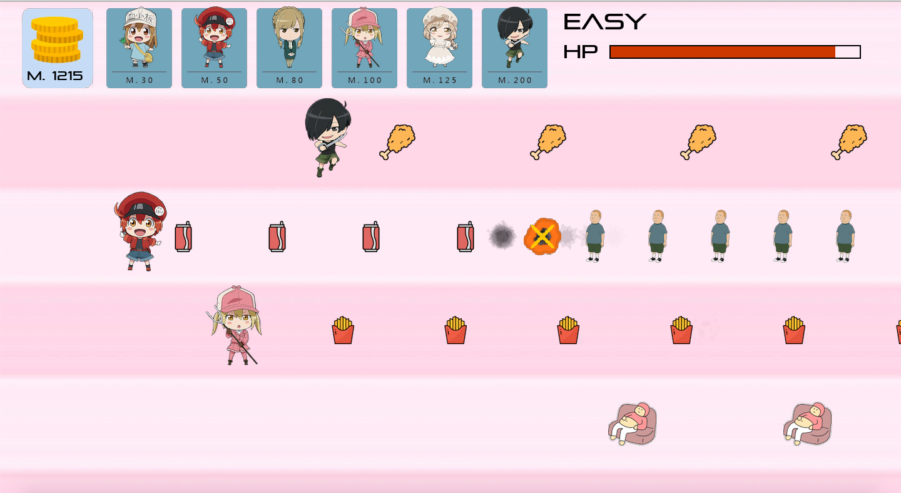

# Tower Defense In Allegro C++
This game is the final project of Course Programmingll done by Allegro C++.

## Prerequisites

Before running the game, you need to install Allegro 5. I downloaded it with mac OS system.

#### XCode

Open `Terminal` and type:

```shell
/usr/bin/ruby -e "$(curl -fsSL https://raw.githubusercontent.com/Homebrew/install/master/install)"
```
Then type:

```shell
brew install allegro
```
Open `XCode`, Create a new `MacOS` project, choose `Cocoa App`.

Choose `Objective-C` for language, and uncheck all other checkboxes.

Go to `Building Settings > All` then find `Search Paths`.

Under `Search Paths`, set `Header Search Paths` to `/usr/local/include` and set `Library Search Paths` to `/usr/local/lib`. Both use `non-recursive`.

After that, click `General`.

Drag the files in library dictionary into the `Linked Frameworks and Libraries`.

Then the prerequisted setting is done!

## Running
Put all files in src and resource dictionary to the project, then start playing!

There's 2 version easy and hard. There'll be a boss in the hard version.

- easy


- hard


Hope you enjoy it.
